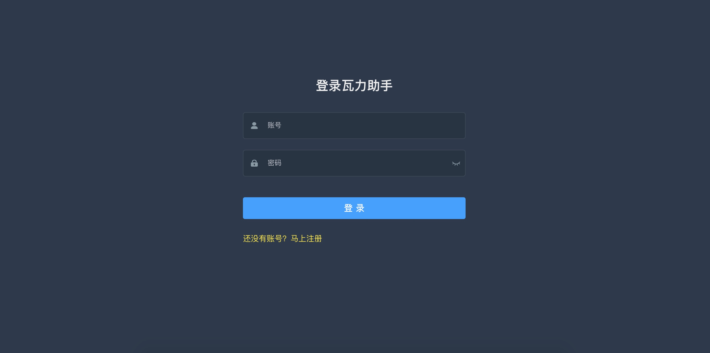
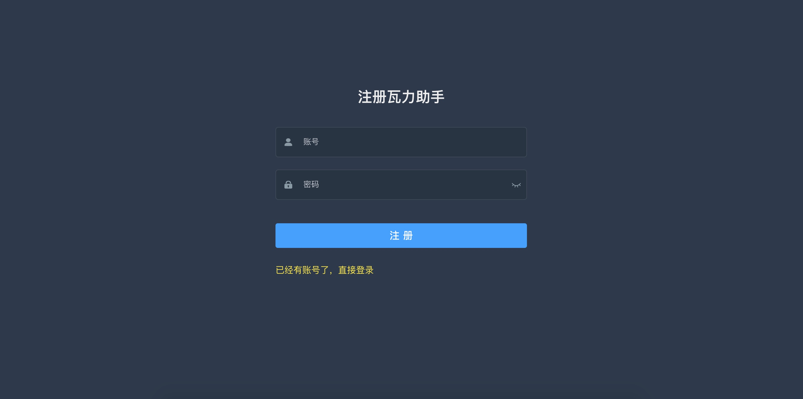
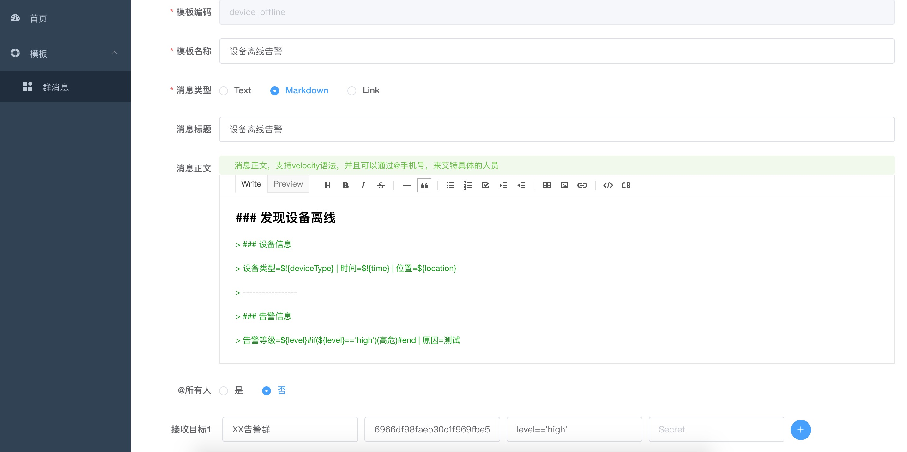
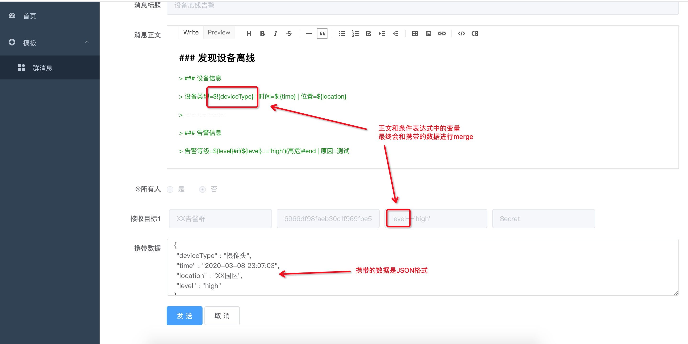
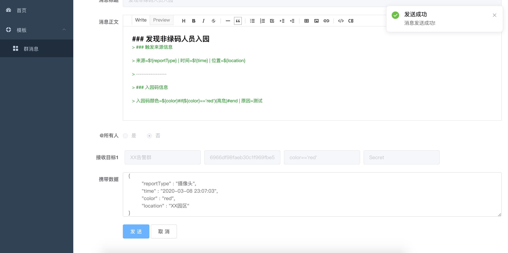
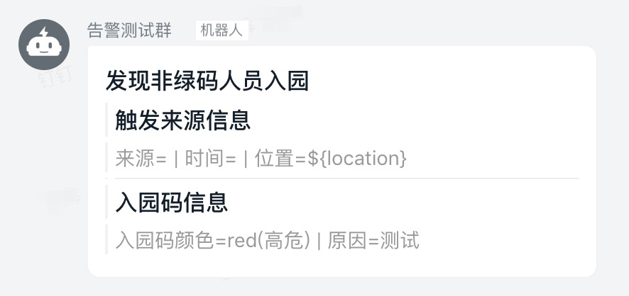
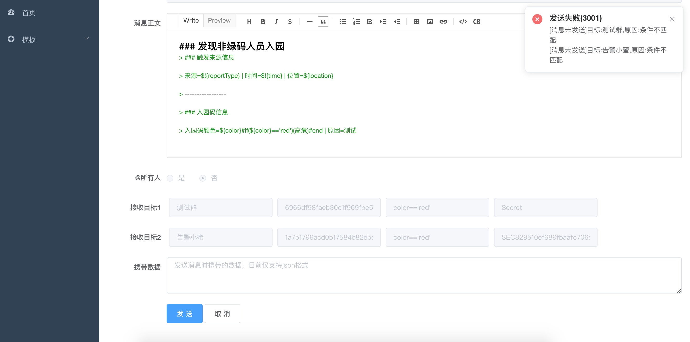

# 瓦力

瓦力是一个轻量级的钉钉群消息发送助手，通过瓦力你只需要配置一个发送消息的模板(支持多个地址，且可以在运行时动态修改)，即可快速实现钉钉群消息的发送功能

首先，我们需要先[将项目运行起来](./md/quick-start.md)。

## **创建账号**

项目运行起来之后，打开 http://localhost:9528

系统会进入登录页面，如下图所示：

项目没有内置账号，我们点击 “马上注册”，进入账号注册页面：

注册成功后，自动跳转回登录页面，输入注册好的账号密码之后，然后点击登录进入首页。

## **创建模板**

登录成功后，进入首页，然后点击左侧的 “模板” —“群消息” 进入群消息模板列表。

然后点击右上角的“新增”按钮，进入创建模板页面，如下图所示：

目前共支持三种类型的群消息：Text、Markdown、Link。

我们以发送 Markdown 类型的群消息为例，创建一个消息模板，具体的内容如下所示：

因为是 Markdown 类型，所以正文是一个 Markdown 编辑器来编辑的，必须是 Markdown 的语法。

可以在正文中加入 @1381338xxxx 的手机号来让机器人艾特群里具体的人员。正文和标题都支持 velocity 语法，可以加入变量。

一个模板至少要有一个接收目标，也可以设置多个接收目标，一个接收目标有四个属性：

| 属性        | 含义                                                 | 必填 |
| ----------- | ---------------------------------------------------- | ---- |
| 机器人名称  | 用来标识这个群机器人的名称                           | 否   |
| accessToken | 这个群机器人的 accessToken，创建群机器人之后可以拿到 | 是   |
| 规则条件    | 一个条件表达式，计算结果为 true 时才会发送消息       | 否   |
| Secret      | 群机器人设置的加签的秘钥                             | 否   |

其中必须的就是 accessToken 这个属性，另外基于安全性的考虑，有三种类型的安全设置([查看详情](https://ding-doc.dingtalk.com/doc#/serverapi2/qf2nxq))：

- **自定义关键词**
- **加签**
- **IP地址（段）**

所以现在我们创建群机器人的话，必须要设置一种安全设置，这里我选择了第二种加签的方式，只需要你把创建机器人的时候设置的密钥填在 Secret 字段里面就好了。

## **发送消息**

### 单个接收目标

选择一个模板然后点击发送消息的按钮，进入消息发送页面，如下图所示：

发送消息时是可以携带数据的，模板的正文、标题会通过 Velocity 渲染成最终的结果。

条件表达式会通过 aviator 计算出结果，结果为 true 时，才会真正执行发送的操作。

数据编辑好之后，点击发送，不出意外应该会发送成功，如下图所示：

然后你的钉钉群将收到消息，如下图所示：

如果我们携带的数据只有一个 color 字段时，那将会收到这样的消息：

消息中来源和时间的值都是空的，而位置的值是 \${location} 这个字符串，这是根据模板中设置的变量有没有加感叹号确定的。

如果加了感叹号：\$!{reportType} 当该变量的值为空时，渲染的结果会是空字符串，否则会将该变量直接展示出来。

### 多个接收目标

我们可以将一个消息同时发给多个不同的钉钉群，只要在模板中设置多个接收目标就好了，这里就不再赘述了。

### 擅用条件匹配

每个接收目标中可以设置一个条件表达式，发送之前会计算条件表达式的值，结果为 true 时才会发送消息。

比如设置如下两个接收目标，条件表达式设置为 [color=='red']，那么只有当携带的数据中有 color 变量，并且值等于 red 时，才会执行消息发送。

PS：条件表达式的计算基于[aviator](https://github.com/killme2008/aviator)

如下图所示，当携带的数据是空时，消息发送失败：

利用条件表达式，我们可以做很多事情，比如：

- 将不同颜色的入园码产生的告警，分发到不同的告警群，让不同的人员去处理
- 将表达式作为开关使用，比如设置表达式为：[false] 或 [1==2] 这样的值，就相当于不向该接收目标发送消息

